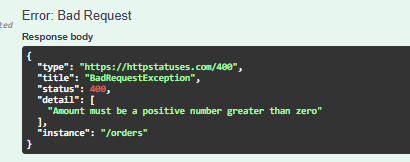

# liao_node
Project templates for node, create node api using Clean Architecture the dotnet way with NestJS

# Controllers

```
@Controller("orders")
export class OrderController {
  constructor(private readonly orderService: OrderService) {}
  @Post()
  @UseInterceptors(LoggingInterceptor)
  async create(@Body() dto: CreateOrderDto) { return this.orderService.create(dto); }

  @Get(':id')
  async findOne(@Param('id', new ParseUUIDPipe()) id: string) {
    return this.orderService.findOne(id);
  }
}

```

# Services
```
@Injectable()
export class OrderService {
  constructor(
    private readonly orderRepository: OrderRepository,
  ) {}

  async create(dto: any): Promise<Order> {
    const newOrder = this.orderRepository.create(dto as object);
    return await this.orderRepository.createAndSave(newOrder);
  }

  async findOne(id: string): Promise<Order> {
    const order = await this.orderRepository.findOne({ where: { id } });
    if (!order) {
      throw new NotFoundException(`Order with ID ${id} not found`);
    }
    
    return order;
  }

  async findAll(): Promise<Order[]> {
    return await this.orderRepository.find();
  }
}
```
# Repositories
```
@Injectable()
export class OrderRepository extends Repository<Order> {
  constructor(private dataSource: DataSource) {
    super(Order, dataSource.createEntityManager());
  }
    
  async createAndSave(orderData: Partial<Order>): Promise<Order> {
    const order = this.create(orderData);
    return await this.save(order);
  }
}
```
# DTOs
```
export class CreateOrderDto {
  @ApiProperty({
    description: 'The business reference for the order',
    example: 'ORD-2026-001',
  })
  @IsString()
  @IsNotEmpty()
  reference: string;

  @ApiProperty({
    description: 'The total amount of the order',
    example: 150.50,
  })
  @IsNotZero()
  amount: number;
}
```
# Entities
```
@Entity('orders')
export class Order {
  @PrimaryGeneratedColumn('uuid') // Automatically generates a UUID v4
  id: string;

  @Column()
  reference: string;

  @Column('decimal', { precision: 10, scale: 2 })
  amount: number;

  @CreateDateColumn()
  createdAt: Date;
}
```

